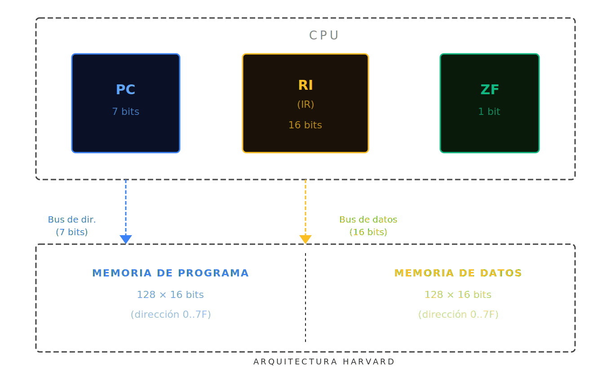
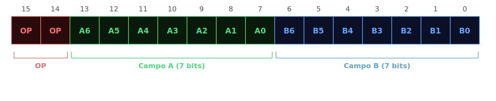

# Arquitectura de la Máquina Simple

## Diagrama de bloques



</div>

Arquitectura **Harvard** — buses físicamente separados para instrucciones y datos.

---

## Registros

| Registro | Bits | Descripción |
|---|---|---|
| **PC** | 7 | Contador de Programa — dirección de la próxima instrucción |
| **RI** | 16 | Registro de Instrucción — instrucción en ejecución |
| **ZF** | 1 | Flag Zero — resultado de la última comparación |

## Memorias

| Memoria | Tamaño | Acceso |
|---|---|---|
| Programa | 128 × 16 bits | Solo lectura durante ejecución |
| Datos | 128 × 16 bits | Lectura y escritura |

---

## Codificación de instrucciones (16 bits)



</div>

| Campo | Bits | Descripción |
|---|---|---|
| OP | [15:14] | Código de operación — 4 instrucciones posibles |
| A | [13:7] | Operando A — dirección en memoria de datos |
| B | [6:0] | Operando B — dirección en memoria de datos o dirección de salto |

---

## Ciclo de instrucción (Fetch-Decode-Execute)

```
1. FETCH    RI ← MEM_PROG[PC]
            PC ← PC + 1

2. DECODE   opcode ← RI[15:14]
            campoA ← RI[13:7]
            campoB ← RI[6:0]

3. EXECUTE  según opcode (ver ISA)
```
