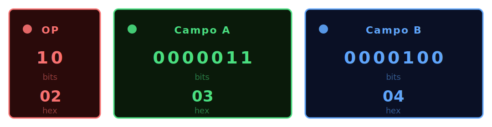

# Guía de uso del simulador

## Pantalla principal — Editor

Al abrir el simulador se muestra el editor ensamblador.

**Botones de ejemplo** — carga uno de los 4 programas de demostración.

**Editor** — escribe o pega tu programa. La sintaxis se valida al ensamblar.

**▶ Ensamblar** — compila el fuente. Si hay errores se muestran en rojo; si no, pasa a la pantalla de ejecución.

**Juego de instrucciones** — referencia rápida siempre visible bajo el editor.

---

## Pantalla de ejecución

### Barra de controles

| Botón | Acción |
|---|---|
| ← Editor | Vuelve al editor (no pierde el programa) |
| ⏭ Paso | Ejecuta una instrucción (fetch-decode-execute) |
| ▶ Ejecutar | Ejecución continua hasta HALT o breakpoint |
| ⏸ Parar | Pausa la ejecución continua |
| ↺ Reset | Reinicia PC=0 y datos a sus valores iniciales |
| Slider Velocidad | Desliza a la derecha para ir más rápido |

**Estados en el header:**
- 🟢 **EJECUTANDO** — animado, ejecución continua en curso
- 🔴 **HALT** — programa terminado

---

## Panel CPU

### PC — Contador de Programa
Dirección de la próxima instrucción en hexadecimal.

### RI — Registro de Instrucción
La instrucción en ejecución desglosada en tres bloques:



</div>

Los bits iluminados (color vivo) son los que están a 1.

### ZF — Flag Zero
- 🔵 Activo (=1): la última `cmp` encontró igualdad, el próximo `beq` saltará
- Inactivo (=0): no saltará

---

## Tabla de símbolos

Lista todos los datos declarados con `dato`. Muestra nombre, dirección y valor actual en hex.

- Los símbolos referenciados por la **próxima instrucción** se resaltan en verde con `◀`
- **Clic en cualquier fila** para editar el valor en tiempo real (acepta decimal o `0x` hex). Confirma con Enter, cancela con Escape.

---

## Listado de programa

Vista unificada instrucciones + datos:

```
 ○  00          mov   CERO   , RDO       0073
 ○  01          mov   CERO   , CONTAD    006C
 ●  02  BUCLE:  cmp   CONTAD , NUM2      84EC   ← breakpoint activo
 ▶  03          beq   FIN               C008   ← PC actual
```

- **○ / ●** — clic para activar/desactivar breakpoint
- **▶** — instrucción apuntada por el PC
- Instrucciones pasadas se atenúan
- Columna derecha: código máquina en hex

---

## Breakpoints

1. Clic en el círculo **○** a la izquierda de cualquier instrucción → se vuelve **●** rojo
2. Al pulsar **Ejecutar**, la ejecución para justo antes de esa instrucción
3. El panel de breakpoints (columna izquierda) lista todos los activos; clic para eliminar

---

## Memoria de datos

Grid hexadecimal 8 columnas × 16 filas (128 celdas).

- La cabecera de columna indica el offset (`+0`..`+7`)
- La cabecera de fila indica la dirección base (`00`, `08`, `10`…)
- Celdas vacías (valor 0) aparecen en oscuro
- Celdas con valor aparecen en gris con borde

---

## Traza de ejecución

Log de todos los pasos ejecutados. El último paso aparece resaltado.

```
#001 PC=00 MOV [5]←0
#002 PC=01 MOV [3]←0
#003 PC=02 CMP 0==3→ZF=0
```

Colores:
- Gris oscuro — paso pasado
- Blanco — último paso
- Naranja — parada en breakpoint
- Rojo — HALT
